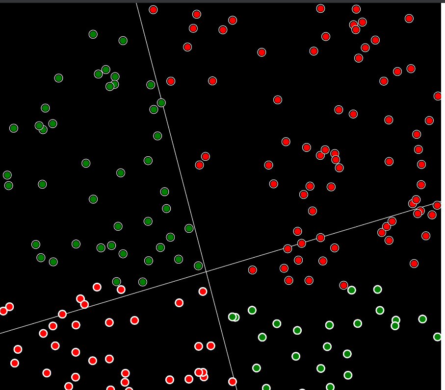

# Building a neural network from scratch:

Starting with a simple _JS_ implementation of a single Perceptron feed-forward system.
Then building a custom neural network library as well as a generalized-matrix library.

---

This is the initial demo, a simple perceptron trying to solve a linear equation. (`y=mx+b`):

